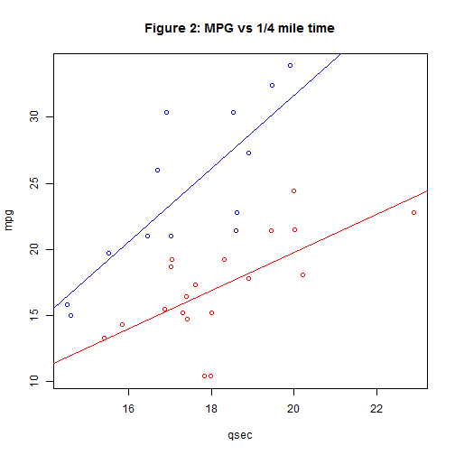

## Building my first Shiny App

Based on the research done for Data Science Specialization - week 7
I build my first shiny.

1. Why this app
2. How does it work
3. Some plots

--- .class #id 

## Why this app

* Based on our reseach in the regression class, we found that Weight, Acceleration & transmisison as the key values to influence the MPG of a car. With this App you can get an good indication of the MPG of your 'new' to buy car.
* I build this online app so with the 'key' indicators you can get an good estimation the MPG
* Next to that we shared some plots that profide more insight on the 'single' relation between MPG and weight, and MPG and QSEC

---

## How does it work - 1

Outline of the key principe: I used the regression model the fit the MPG about on the key values in the Server.R - as you can see here:


```r
data(mtcars)
automatics <- mtcars[mtcars$am == 0,]
manual <- mtcars[mtcars$am == 1,]
fit <- lm(formula = mpg ~ wt + qsec + am, data = mtcars)
predmpg<-function(weight, qpsec, amto){
  predict(fit, newdata = data.frame(wt = weight, qsec = qpsec, am = amto))
}
shinyServer(
  function(input, output){
    output$prediction <- renderPrint({predmpg(input$weight, input$qpsec, input$amto)})
    })
```

```
## Error: could not find function "shinyServer"
```

---

## How does it work - 2


in the ui.R sidebarPanel you can add the value and get the prediction back


```r
  sidebarPanel(
    numericInput('weight','Weight of the desired car in 1000 lbs:', 2, min=1, max=6, step=0.5),
    numericInput('qpsec', 'Acceleration of the desired car in qsec:', 16, min=14, max=23, step=0.5),
    numericInput('amto', 'Automatic 1= yes, 0 = no:', 0, min=0, max=1, step=1),
    submitButton('Calculate MPG'),
    verbatimTextOutput("prediction")
  )
```

```
## Error: could not find function "sidebarPanel"
```

---

## Some plot

* I shared some more exploratory analytics to look a little deeper into the relation MPG and the car weight and MPG and the acceleration time, to provide deeper understanding on the relation. 
* For this I used a Radio button in the ui.R and the flowing plotting code


```r
 plot(mpg ~ qsec, data=mtcars, type='n', main = 'Figure 2: MPG vs 1/4 mile time')
        points(mpg ~ qsec, data=automatics, col = 'red')
        line3 <- lm(mpg ~ qsec, data = automatics)
        abline(line3, col = 'red')
        points(mpg~ qsec, data=manual, col='blue')
        line4 <- lm(mpg ~ qsec, data = manual)
        abline(line4, col ='blue')
```

 


